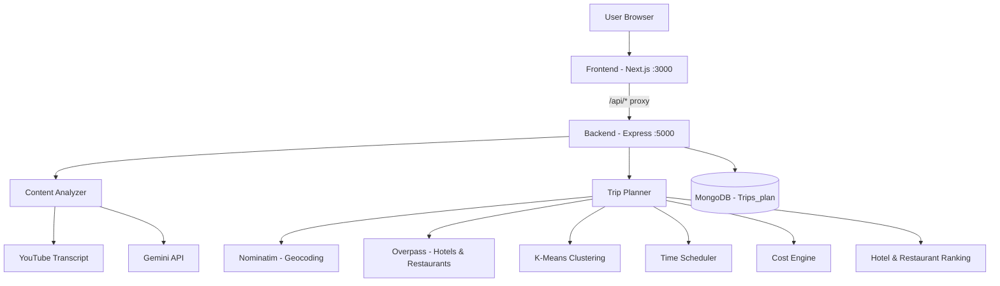
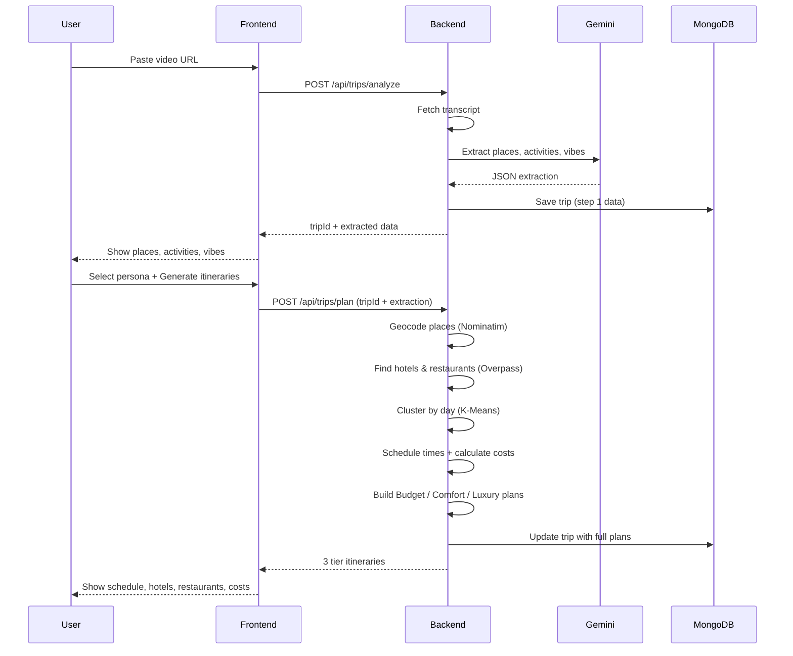

# Travel Trip Planner

Turn a YouTube travel video into a personalized itinerary with Budget, Comfort, and Luxury plans.

---

## Prerequisites

- [Node.js](https://nodejs.org/) 18 or later
- [MongoDB](https://www.mongodb.com/) running locally (optional, but recommended for saving trips)
- A [Google Gemini API key](https://aistudio.google.com/apikey)

---

## Setup

### 1. Backend

```bash
cd Backend
npm install
```

Copy the example env file and add your API key:

```bash
copy .env.example .env
```

Edit `Backend/.env`:

```env
GEMINI_API_KEY=your_gemini_api_key_here
GEMINI_MODEL=gemini-2.5-flash
MONGODB_URI=mongodb://localhost:27017/Trips_plan
PORT=5000
FRONTEND_URL=http://localhost:3000
```

### 2. Frontend

```bash
cd Frontend
npm install
```

The frontend uses a built-in proxy to the backend. No extra env setup is required for local development.

---

## How to Start

Open **two terminals**.

**Terminal 1 — Backend**

```bash
cd Backend
npm run dev
```

Backend runs at: http://localhost:5000

**Terminal 2 — Frontend**

```bash
cd Frontend
npm run dev
```

Frontend runs at: http://localhost:3000

Open http://localhost:3000 in your browser.

---

## How to Use

1. Paste a **YouTube** or **Instagram** travel video URL.
2. Click **Generate Trip** to extract places, activities, and vibes.
3. Choose your travel style, group, pace, and trip length.
4. Click **Generate itineraries** to see Budget, Comfort, and Luxury plans.

---

## High-Level Design (HLD)

### Core idea

**AI is used only for understanding the video.**  
**Everything else is algorithmic** — geocoding, hotel/restaurant selection, day clustering, scheduling, and cost calculation.

| Step | Who handles it | What happens |
|------|----------------|--------------|
| Video transcript | Algorithm | Fetch captions from YouTube / Instagram |
| Extract places, activities, vibes | **AI (Gemini)** | Read transcript and return structured JSON |
| Geocode locations | Algorithm | Nominatim (OpenStreetMap) |
| Find hotels & restaurants | Algorithm | Overpass API (OpenStreetMap) |
| Rank hotels & restaurants | Algorithm | Score by price, rating, distance, persona |
| Split places by day | Algorithm | K-Means clustering |
| Build daily schedule | Algorithm | Time slots, meals, transit between stops |
| Calculate costs | Algorithm | Hotel + food + activities + transport |
| Trip descriptions | Algorithm | Template-based day summaries |
| Save trip data | Database | MongoDB (`Trips_plan`) |

---

### System architecture



---

### User flow (2 steps)



---

### Backend pipeline detail

#### Step 1 — `POST /api/trips/analyze`

```
Video URL
  → Fetch transcript (YouTube / Instagram)
  → Gemini extracts: places, activities, vibes
  → Save to MongoDB
  → Return tripId + extraction to frontend
```

#### Step 2 — `POST /api/trips/plan`

```
Persona (style, group, pace, days) + extraction from step 1
  → Geocode each place (Nominatim)
  → Find nearby hotels & restaurants at trip center (Overpass)
  → Cluster places into days (K-Means)
  → For each tier (Budget / Comfort / Luxury):
      → Rank best hotel & restaurants
      → Build day-by-day schedule with times
      → Calculate total cost
      → Generate trip summary text
  → Save full plans to MongoDB
  → Return all 3 plans to frontend
```

---

### What each plan includes

Every tier (Budget, Comfort, Luxury) contains:

- **Hotel** — name, star rating, price per night
- **Restaurants** — name, cuisine, rating, price per person
- **Daily itinerary** — places, meals, transit, times
- **Cost breakdown** — hotel, food, activities, transport, total
- **Tour suggestions** — based on travel style and vibes

---

### Tech stack

| Layer | Technology |
|-------|------------|
| Frontend | Next.js, React, Tailwind CSS |
| Backend | Node.js, Express, TypeScript |
| Database | MongoDB (`Trips_plan`) |
| AI | Google Gemini (extraction only) |
| Maps / Places | Nominatim + Overpass (OpenStreetMap) |

---

## Project Structure

```
├── Backend/     # Express API (trip planning, AI extraction)
├── Frontend/    # Next.js app (UI)
└── README.md
```

---

## Troubleshooting

| Issue | Fix |
|-------|-----|
| `Cannot connect to backend` | Make sure Backend is running on port 5000 |
| Port 5000 already in use | Run `npm run free-port` inside `Backend`, then `npm run dev` |
| Gemini rate limit / busy | Wait a minute and try again |
| No transcript found | Use a YouTube video with captions enabled |
| MongoDB not saving | Start MongoDB locally and check `MONGODB_URI` in `.env` |

---

## Production Build

**Backend**

```bash
cd Backend
npm run build
npm start
```

**Frontend**

```bash
cd Frontend
npm run build
npm start
```
# Trip_Planer
